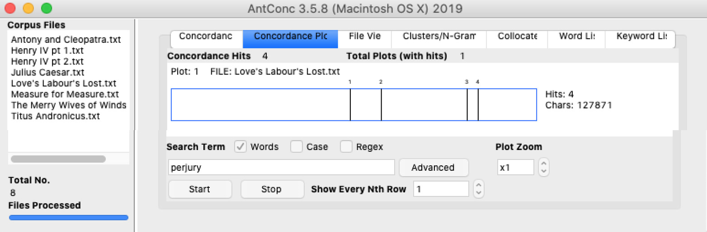
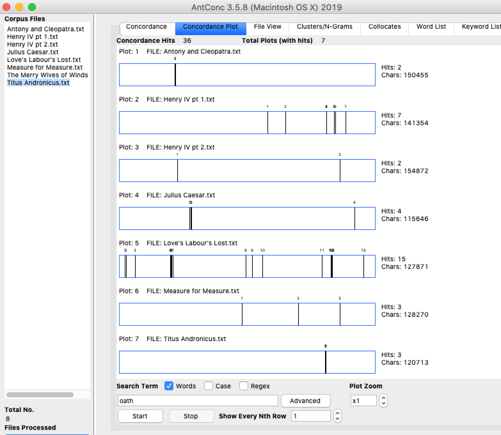
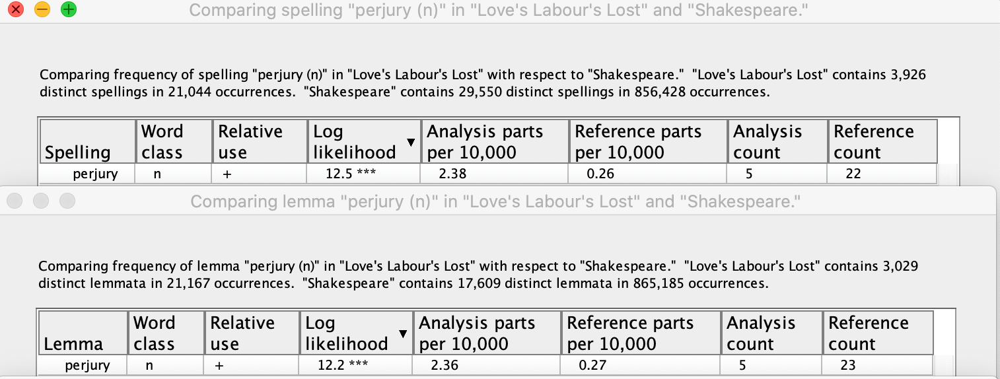
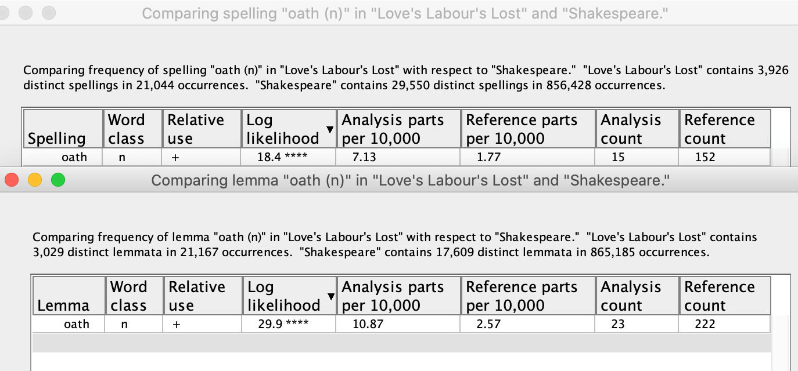
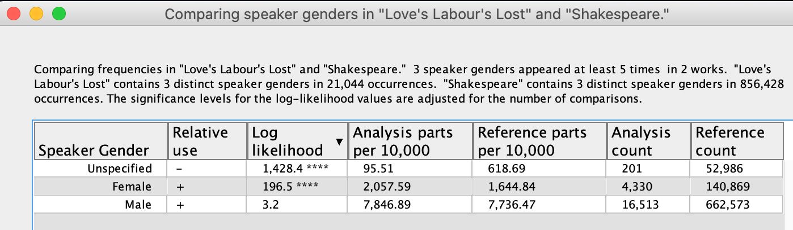
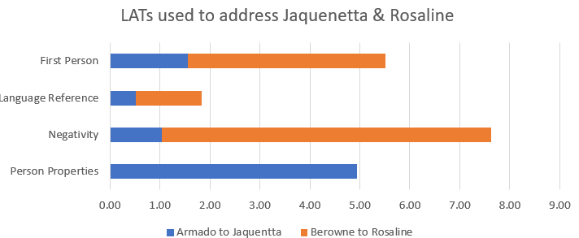

**Are characters of opposing social ranks treated differently in _Love's Labour's Lost_**

_Love’s Labour’s Lost_ is one of Shakespeare’s earliest comedies focusing on the story of a King and his friends pledging themselves to an unbreakable three-year term of study free from the temptations of female company. The three prominent themes within Love’s Labour’s Lost are gender, nobility and perjury with gender as our primary research area, but we found looking into the theme of ‘perjury’ was the best place to start our analysis.  With the King and his men swearing an oath to avoid the temptations of lust to bolster their learning capabilities and ‘perjury’ covering lying under oath in definition, we felt that analysing the editorial claim in the Woudhuysen edition of Love’s Labour’s Lost that ‘perjury’ and ‘being perjured’ is featured more heavily in our primary text than in any other Shakespearean play.

**Perjury Analysis - AntConc**
==============================

To begin with, we felt that identifying the frequency ‘perjury’ occurred in our chosen corpus was of urgency.  The plays we chose for inclusion in our corpus are covered below:

_Anthony and Cleopatra_ — A tragedian history play focussed on a powerful noble couple with broken alliances as a theme, which could link in well to perjury.

_Henry IV part I and part II_ — History plays featuring verbal bonds as a thematic device, again a good link with perjury and including history plays makes a comparison across genres possible.

_Julius Caesar_ — A history play with bureaucratic deception involved in the plot, included for the same reasoning as the prior two plays.

_Measure for Measure_ — A comedy mixed with tragedy centred on a nun avoiding abstinence for her brother’s sake, almost the complete opposite to the oath sworn by the King and his men in LLL and is in the same genre.

_The Merry Wives of Windsor_ — A comedy focussed on chasing seduction for personal gain.

_Titus Andronicus_ — A tragedy about a gendered noble power shift, with a prominent female character rising in social rank.

In the seven Shakespeare plays looked at, AntConc helped confirm that ‘perjury’ was featured most frequently in _LLL_ compared to the rest of our corpus, to the point it was the only play to register any results:

<figure>

</figure>

We then decided to identify the frequency of the word ‘oath’ too, as perjury can define lying under oath, so felt it linked in well. Below are the results:

<figure>

</figure>

As can be seen, ‘perjury’ and ‘oath’ are mentioned more frequently in _LLL_ in comparison to our selection of Shakespeare plays.  But to fully confirm Woudhuysen’s footnote theory, we would also need to use WordHoard to look into the significance of the use of such words.

**Perjury Analysis - WordHoard**
================================

By using the ‘compare single word form’ analytical tool we were able to compare the log-likelihood of our chosen words, as well as ‘forswear,’ included as this is the act of breaking an oath or binding promise, so fits into the wider thematic issues considered in our research.  This provided the following results:

<figure>

</figure>

<figure>

</figure>

<figure>

</figure>

As can be seen from the largely positive log-likelihood values, ‘perjury,’ ‘oath’ and ‘forswear’ are not only used more frequently, there use is more likely to occur in _LLL_ than Shakespearean works as whole.  Thus, supporting Woudhuysen’s claim about ‘perjury’ and ‘being perjured.’

**Gender Analysis - WordHoard and Ubiqu+ity**
=============================================

As our initial research question related to female characters of different social rank and how they were handled in the script, we then used the compare many word form frequencies tool in WordHoard comparing the speaker gender word form.  This identifies the log-likelihood values of a given speaker in play being female, male of unspecified. Below are the results:

<figure>

</figure>

As can be seen in the table, the log-likelihood of the speaker being female in Love’s Labour’s Lost when compared to Shakespeare’s corpus is massively positive, 196.5, which here is significant to the 0.01% level. Even though the analysis count is nominally higher for male speakers in our primary text in comparison to their female counterparts, roughly 16,500 to 4,300, the use of female dialogue in our primary text is much more likely to occur, on average, than in Shakespeare’s body of works as a whole.  This is indicative of how important the Princess and her female courtiers are to the action in _Love’s Labour’s Lost_.

We also used a program called Ubiqu+ity to break down the language used within the play to address Jaquenetta, a dairymaid and romantic interest of two of the King’s hierarchy, and Rosaline, a member of the Princess of France’s inner circle with Berowne as a potential suitor. Below is a graphical representation of our findings:

<figure>

</figure>

First, the LATs shown above are covered in more detail; the first person LAT relates to the speaker’s use of words indicating self-reference; the language reference LAT highlights the use of words or punctuation referring to language itself or objects associated with language like character names and asides; the negativity LAT accounts for words that suggest negative emotions; and finally, the person properties LAT relates to the use of formal words describing one’s occupation or social standing.

Here, it is evident that Armado’s letter to Jaquenetta includes more references to social status but uses less self-centred language than Berowne’s conversation with Rosaline.  There is also a lot more negative language used by Berowne, surprising when considered against the tone of patriarchal dominance assumed in Armado’s letter, but this may be down to the face-to-fact nature of Rosaline’s rejection of his verbal advances.  Fitting in with the learned focus of the plot to _LLL_, Berowne uses more words referencing language itself in his correspondence which is an example of metatheatre as well as a reference to the function of language itself in wider society. 

**Character's Dialogue**
========================

To deepen our analysis of the play, we created a java program which would seperate the dialogue of several different characters. The text files generated from the program can be accessed below:

[Berowne](berowne.txt)

[Rosaline](rosaline.txt)

[Jaquenetta](jaquenetta.txt)

