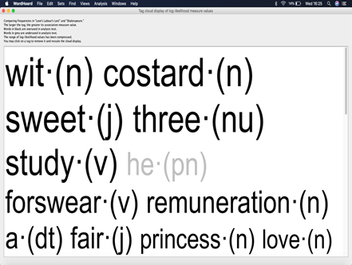
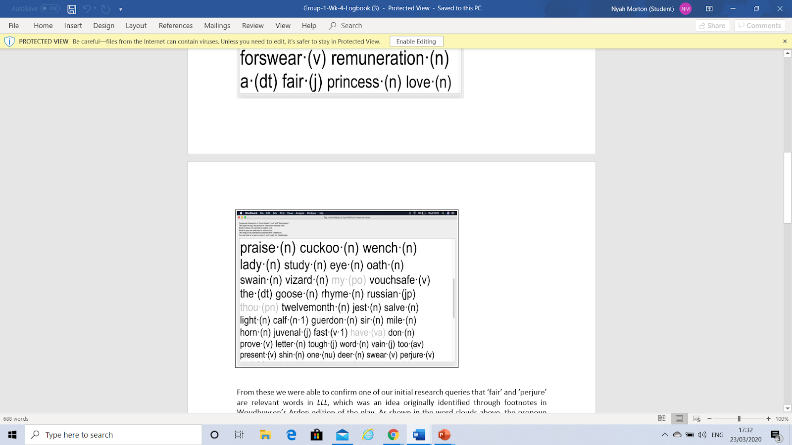
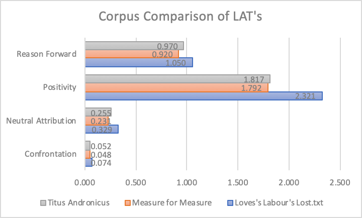

Love’s Labour’s Lost is one of Shakespeare’s earliest comedies focusing on the story of a King and his friends taking an oath to dedicate themselves to a life of study and avoid the company of women for three years. The three prominent themes within Love’s Labour’s Lost are gender, friendship and loyalty. The theme that we are most interested with is gender as it is the theme that our question deals with. 

**Wordhoard Analysis**
======================
WordHoard was a good starting point for our research as it is a tool which allows us to compare the frequencies of different words within different text files. This will allow us to see which words are the most significant within the plays.

<figure>

</figure>

<figure>

</figure>

These are the results that we received from WordHoard when we used it to analyse which words occurred most frequently in Love’s Labour’s Lost. We found it surprising and intriguing that many female pronouns, or words which are associated with females, which motivated us to explore the theme of gender within the play.

**AntConc Analysis**
====================

<figure>

</figure>

According to the Woudhuysen edition, LLL uses ‘Fair’ with no fixed meaning and relates to ‘perjury’, more than any other play by Shakespeare. Through concordance plots we were able to prove:
•	‘Perjury’ is an important theme, but oath is far more significant
•	‘Fair’ will be covered in the next slide’s analysis...

**Ubiqu+ity**
=============

We ran several plays in comparison with LLL, the graph backs up Woudhuysen’s edition identifying ‘fair’ as being used with no fixed definition more so than any other work of Shakespeare.

<figure>

</figure>

Reason Forward: The speaker or writer leads the audience through his or her sequence of thoughts.
Positivity: The text indicates a person in a state of happiness, or some other feel-good emotion.
Neutral Attribution: No entry in LAT guide, but relates to Woudhuysen’s identification as ‘fair’ being used in LLL without any fixed meaning compared to other works of Shakespeare.
Confrontation: The reader or a character of a text is being threatened directly by the author or another character in the world of the text, respectively.

**Texts Compared In Corpus**
============================
Antony and Cleopatra: tragedian history, focussed on powerful noble couple with broken alliances as a theme.
Henry IV: history, about King Henry IV with oath swearing featured as a device.
Julius Caesar: history, bureaucratic deception involved in action.
Measure for Measure: tragic comedy, centred around a nun avoiding abstinence for her brother’s sake, opposite of the oath sworn by the King and his followers in LLL.
The Merry Wives of Windsor: comedy about chasing seduction for personal gain.
Titus Andronicus: tragedy about a noble power shift, with a prominent female character rising in social rank.

**Character's Dialogue**
========================

To deepen our analysis of the play, we created a java program which would seperate the dialogue of several different characters. The text files generated from the program can be accessed below:

[Berowne](berowne.txt)

[Rosaline](rosaline.txt)

[Jaquenetta](jaquenetta.txt)

