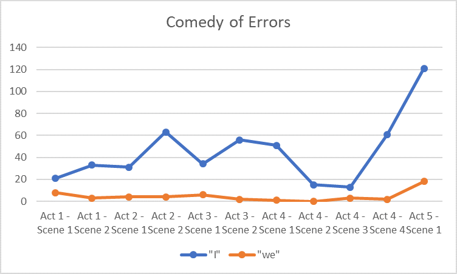
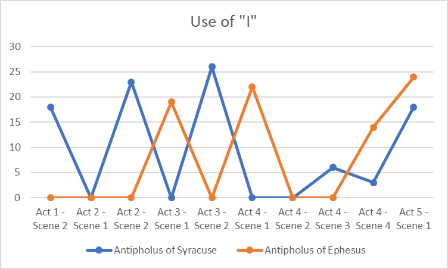
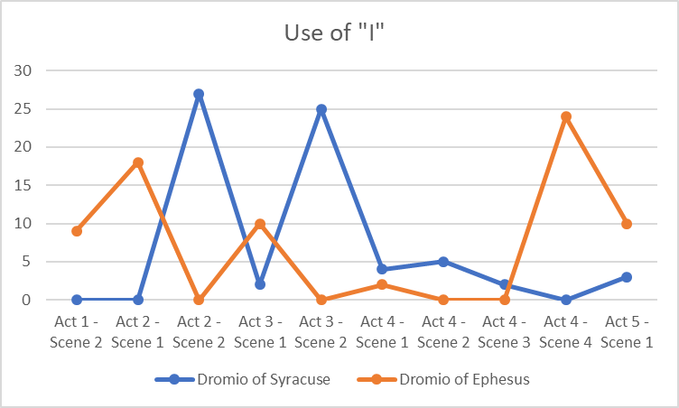
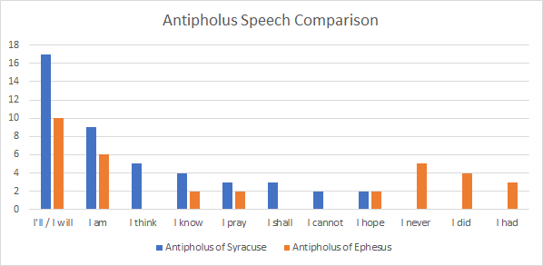

# Summary

After both being separated from their twins in a shipwreck, Antipholus and his slave Dromio go to Ephesus to find them. The other set of twins lives in Ephesus, and the new arrivals cause a series of incidents of mistaken identity. At the end, the twins find each other and their parents and resolve all of the problems caused earlier.

# Identity

One of the key thematic components of Comedy of Errors is it’s focus on the 
search for identity. This is a theme common in many of Shakespeare’s plays, 
with identity and misconception often being intertwined. In Othello, 
misconception and deception were used to explore the isolation of the plays 
central character. As seen in our section on Othello, an increased use of I 
is a common feature of plays based on misunderstanding. This section will 
look at how “I” is used in Comedy of Errors and how this contributes to the 
theme of identity construction. All data from this section derives from data 
taken from the Extractor program and analysed through AntConc.

One of the play’s central characters, Antipholus of Syracuse, illustrates 
the importance of identity when he describes his quest to find his mother 
and brother in the following way:

“I to the world am like a drop of water
That in the ocean seeks another drop,
Who, falling there to find his fellow forth,
Unseen, inquisitive, confounds himself.
So I, to find a mother and a brother,
In quest of them unhappy, lose myself.” (Act 1, Scene 2)

“I to the world am like a drop of water
That in the ocean seeks another drop,
Who, falling there to find his fellow forth,
Unseen, inquisitive, confounds himself.
So I, to find a mother and a brother,
In quest of them unhappy, lose myself.” (Act 1, Scene 2)

<figure>

</figure>

As shown in Figure 1, “I” is consistently used more than “we” throughout 
each act of the play. Interestingly, both “I” and “we” are more frequently 
used at the end of the play, with Act 4, Scene 3 having the lowest use of “I”
and Act 5, Scene 1 having the highest. The final scene of the play having 
the greatest use of “I” and “we” makes sense when considering what occurs 
in this act. The play’s final scene features the most heightened confusion 
of identity, as well as the ultimate reveal of the twin’s true identity. 
From this, it makes sense that this scene would have the greatest use of “I”
as it is when the reality of the situation is exposed, and their 
identities is ultimately revealed. Comparatively, the use of “we” being  
highest in the final scene also makes the most amount of sense as it this 
scene ultimately ends with the twins being reunited. This companionship is 
perhaps best illustrated in the final line of the play, said by Dromio of 
Ephesus:

“We came into the world like brother and brother,
And now let’s go hand in hand, not one before another.” (Act 5, Scene 1)

Dromio’s final line ultimately illustrates the completion of the quest 
outlined by Antipholus of Syracuse. The emphasis not to go “one before 
another” illustrates an acceptance of their new homosocial relationship and 
an acceptance of their identities by those around them.

<figure>

</figure>

Looking specifically at the Antipholus twins (Figure 2), we can see the 
contrast between the use of “I” by both twins. Interestingly, in the middle 
acts of the play both Antipholus’ have the greatest uses of “I”, 
illustrating the confusion around their identity as both twins have to 
assert their identity against the confusion of the world around them. From 
this, it is understandable why “I” would be used most frequently during this 
section. It is also worth considering that both twins do not speak in the 
same act till act 4, scene 4. Antipholus of Syracuse has the greatest uses 
of the word “I”, comparatively, which could be argues to illustrate his 
journey towards self-discovery throughout the play. Antipholus of Ephesus, 
however, has a greater use of “I” in the final scenes. This makes sense when 
considering that Antipholus of Syracuse is the imposter, taking the life of 
his twin which means that in the final scenes it is Antipholus of Ephesus 
who must defend his identity in order to reclaim it. 

<figure>

</figure>

The Dromio twins have perhaps the most illustrative example of how the use 
of “I” can reveal thematic aspects of the text. Unlike the Antipholus twins, 
both Dromion’s have the highest uses of “I” during the periods where one of 
them is confused for the other. Though this is similar for the Antipholus 
twins, the Dromio twins are both servants and thus they have less authority 
to convince the world of their truth. This is perhaps best illustrated by 
Dromio of Syracuse’s conversation with Antipholus of Syracuse in Act 3, 
Scene 2. 

“Do you know me sir? Am I
Dromio? Am I your man? Am I myself?” (Act 3, Scene 2)

Here Dromio, instead of asserting his identity against the backdrop of 
misconception, questions his master to reveal the truth of his identity. 
Dromio is himself uncertain, unlike the Antipholus twins, and thus his 
identity becomes the product of his environment. This makes the Dromio twins 
effectively interchangeable. This also reflects one of the broader 
explanations of identity in the play. Both twins are the product of their 
environment, Antipholus of Syracuse is shaped by the quest for his mother 
and brother, whereas Antipholus of Ephesus is defined by his loveless 
marriage. This isn’t reflected in the Dromio twins however, but that is more 
likely a product of their similarity. Both Dromio twins have the same 
position, as servants, and thus their identities are likely more the product 
of their position than where they were born. The Antipholus twins, however, 
appear to be shaped more by their social environment as both long for the 
homo-social bonding they ultimately find.

The analysis so far has focused solely on the frequency of “I” usage in 
Comedy of Errors, but not on how “I” is used in the play. 

<figure>

</figure>

Figure 4 illustrates the most frequent bigram usage between the two central 
Antipholus twins. From the data presented, a number of interesting 
observations can be made. For both Antipholus’ the bigram “I’ll” and “I will”
are used most which demonstrates, perhaps, the farcical nature of the play. 
Comedy of Errors is a play in which characters actions drive the narrative, 
with comedy and tension derive from each character’s perception of reality. 
As Antipholus of Syracuse is on a journey to find his brother and mother, 
this may explain his more frequent use of “I’ll” as it is his quest which 
drives the narrative foreword. Antipholus of Syracuse also uses “I am”, “I 
know” and “I pray” more than his twin and uses “I think”, “I shall” and “I 
cannot” when his twin does not. The greater use of “I am” and “I know” is 
important to consider as these are both declarative statements, and can thus 
be seen to demonstrate the confusion over Antipholus of Syracuse’s true 
identity, with “I pray” illustrating his optimism in resolving the play’s 
central confusion. It is also worth considering the fact that “I cannot” is 
one of the least frequent “I” bigrams which Antipholus of Syracuse solely 
uses. Looking at Antipholus of Ephesus, it is worth considering that he uses 
“I never”, “I did” and “I had” while his twin does not. This illustrates a 
greater negativity presented by Antipholus of Ephesus, with all the “I” 
bigrams focusing on the past tense, this perhaps demonstrates the fact he 
has had his identity stolen by his twin brother. 

Comparing this with Egeon, who is not featured in this graph due to his 
minor role in the play, his bigram usage reflects his lost son, Antipholus 
of Ephesus. Both “I am” and “I had” are the most frequently used by Egeon. 
This could be said to illustrate his quest to regain his identity through 
reuniting his family. Although both twins have “I am” as one of their most 
frequent bigrams, Egeon does not use “I’ll” or “I will” because he does not 
push the plot forward, but instead his speech functions more as the framing 
device/background to the play. The fact that “I had” is also one of the most 
frequently used words for Antipholus of Ephesus, it could be argued this 
comparison could illustrate the comparatively similar journeys of both 
characters. Both father and son attempt to regain their identity by 
attempting to gain what they have lost, which is their family in both cases.
