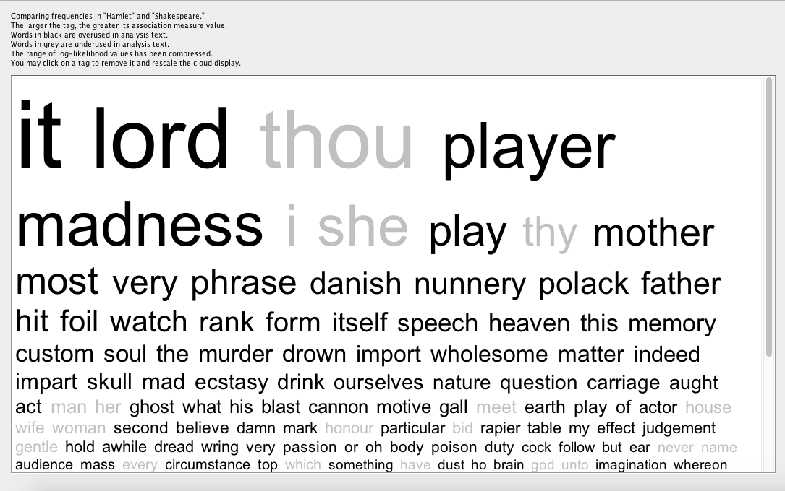
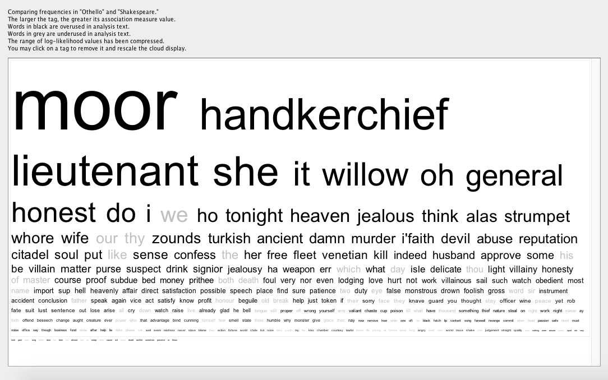
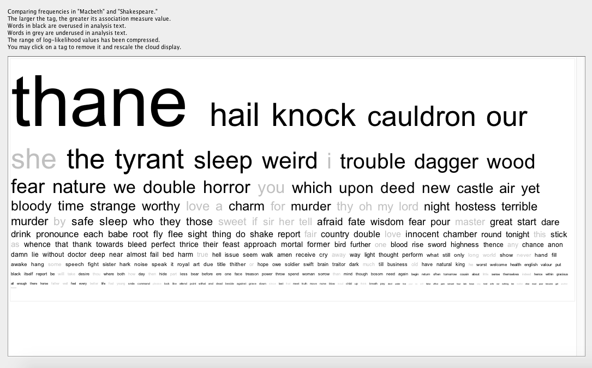
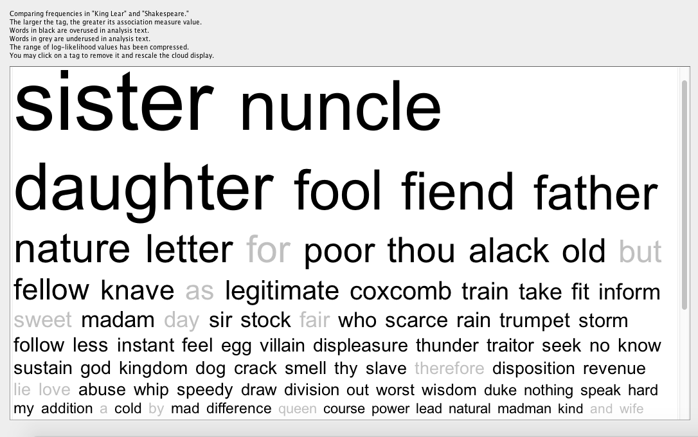
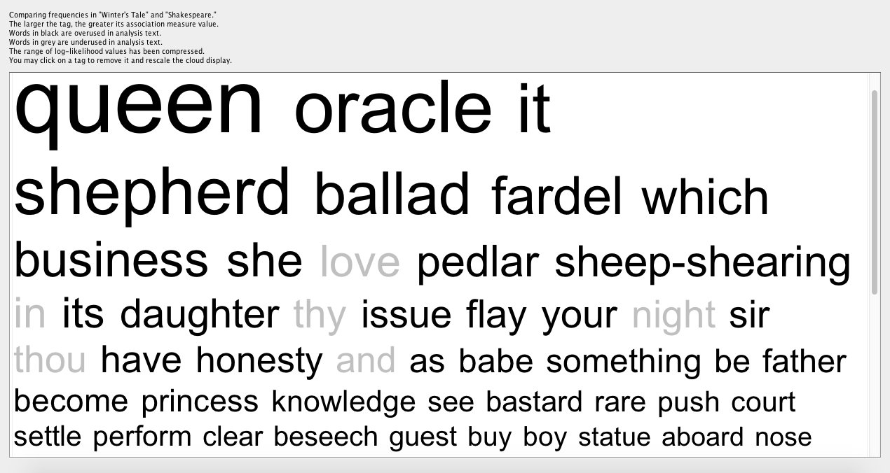
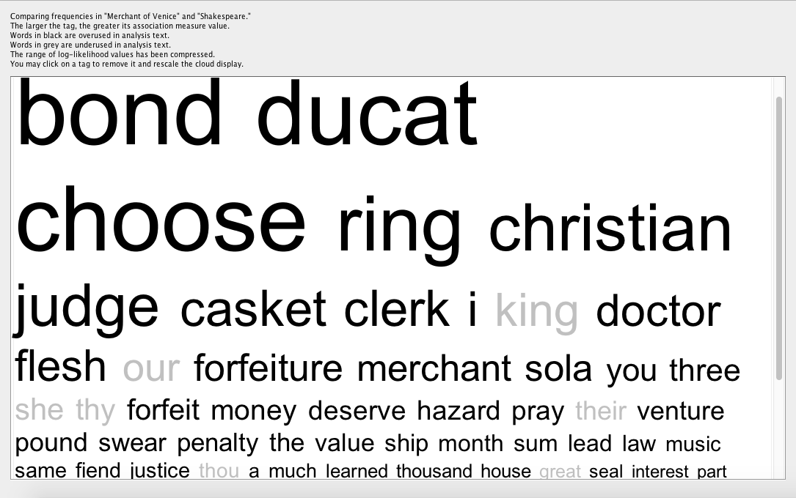
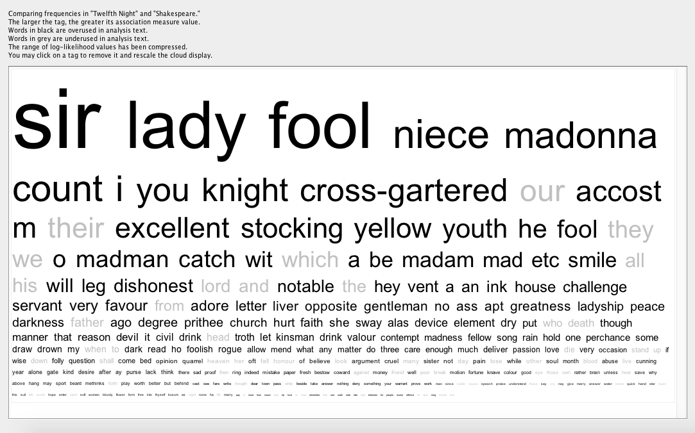

Word Clouds are a feature of WordHoard that display the relative use of words in
each play in comparison to the rest of Shakespeare’s corpus. Below you can find
Word Clouds for some of Shakespeare’s most studied plays.

Large words in black indicate words that are used more often than would be
expected in comparison to the rest of Shakespeare’s plays.

Large words in grey indicate words that are used less often than would be
expected in comparison to the rest of Shakespeare’s plays.

The smaller the words, the smaller the discrepancy.

Be aware: Word Clouds alone may not be sufficient evidence to back up an
analysis. For example, in Hamlet it is not surprising that words like ‘madness’
and ‘Danish’ appear more often than the rest of Shakespeare’s plays, however,
the reduced occurrence of feminine pronouns like ‘she’ may be something to
investigate further.

# Hamlet

# Julius Caesar

# Othello

# Macbeth

# Romeo and Juliet

# Richard II

# A Midsummer Night’s Dream

# King Lear

# The Winter’s Tale

# Merchant of Venice

# Twelfth Night

